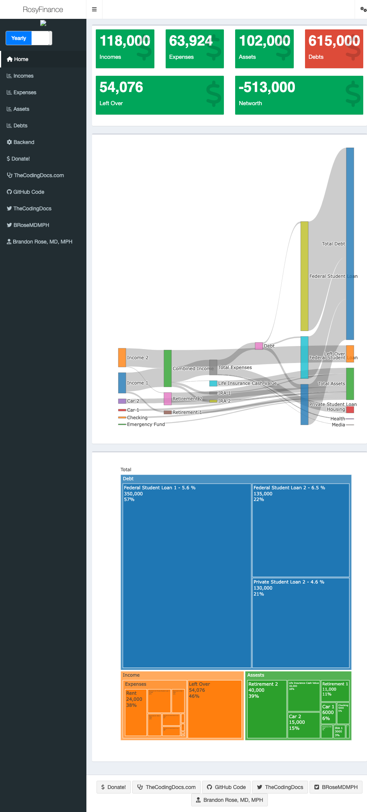

<!-- README.md is generated from README.Rmd. Please edit that file -->

# RosyFinance 

<!-- badges: start -->

[](https://lifecycle.r-lib.org/articles/stages.html#experimental)
[](https://github.com/brandonerose/RosyFinance/actions/workflows/R-CMD-check.yaml)
<!-- badges: end -->

## RosyFinance

RosyFinance is golem shiny app to visualize a budget and networth. It
uses an R6 object to manage the dataset.

``` r
# install remotes package if you don't have it
# install.packages("remotes") 
# install Rosyverse metapackage which has a function called `update_all()`
remotes::install_github("brandonerose/RosyFinance")
```

## RosyFinance Example

``` r
library("RosyFinance")
finances <- load_finances()
finances$calc_incomes()
#> [1] 118000
finances$calc_assets()
#> [1] 102000
finances$calc_debts()
#> [1] 615000
finances$calc_expenses()
#> [1] 63924
finances$calc_left_over()
#> [1] 54076
finances$calc_net_worth()
#> [1] -513000

# finances$finances$make_sankey() # can generate outside of shiny app
# finances$finances$make_treemap() # can generate outside of shiny app
# launch app!
run_RosyFinance()
#> Loading required package: shiny
#> 
#> Listening on http://127.0.0.1:7755
```



## Future plans

- Personal development project at the moment. No big plans.

## Links

The RosyFinance package is at
[github.com/brandonerose/RosyFinance](https://github.com/brandonerose/RosyFinance "RosyFinance R package")
See instructions above. Install remotes and install RosyFinance

Donate if I helped you out and want more development (anything helps)!
[account.venmo.com/u/brandonerose](https://account.venmo.com/u/brandonerose "Venmo Donation")

For more R coding visit
[thecodingdocs.com/](https://www.thecodingdocs.com/ "TheCodingDocs.com")

For correspondence/feedback/issues, please email
<TheCodingDocs@gmail.com>!

Follow us on Twitter
[twitter.com/TheCodingDocs](https://twitter.com/TheCodingDocs "TheCodingDocs Twitter")

Follow me on Twitter
[twitter.com/BRoseMDMPH](https://twitter.com/BRoseMDMPH "BRoseMDMPH Twitter")

[](http://www.thecodingdocs.com)
